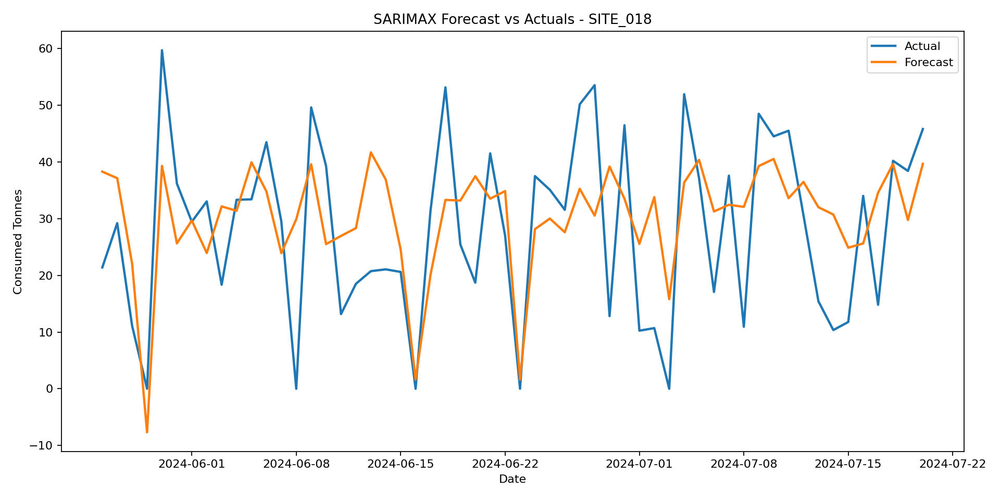

# Baseline Model Results

## Model Overview

This report documents the SARIMAX baseline model for cement consumption forecasting.

## Dataset Setup

- Site ID: `SITE_018`
- Target variable: `consumed_tonnes`
- Exogenous variables:
  - `planned_pour_tonnes`
  - `rain_mm`
  - `avg_temp_c`
- Training observations: 876
- Forecast/test observations: 56
- Forecast horizon: 56 days

## Hyperparameters

- Model type: `SARIMAX`
- order: `(0, 0, 2)`
- seasonal_order: `(0, 2, 2, 7)`
- AIC: 6696.3190
- enforce_stationarity: `False`
- enforce_invertibility: `False`

## Performance Metrics

| Metric | Value |
| --- | ---: |
| MAPE | 55.57% |
| RMSE | 13.23 tonnes |

## Forecast Visualization

## Diagnostic Tests

| Test | Value | Interpretation |
| --- | ---: | --- |
| Ljung-Box p-value, lag 10 | 0.573660 | Higher values suggest less remaining autocorrelation in residuals. |
| Jarque-Bera normality p-value | 0.000778 | Higher values suggest residuals are closer to normally distributed. |

## Artifacts

- Forecast visualization: `sarimax_forecast.png`
- Report: `baseline_model_results.md`
